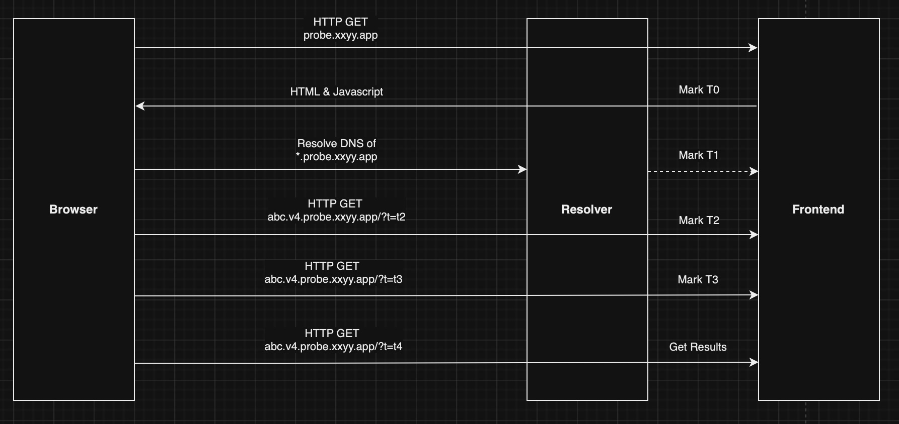

# Description
A dns probing tool which shows your DNS resolver IPs and latancy.

It can also test if your browser supports HTTP3 and show your IP addresses.

See the architecture image below for technical details.

# Deploy
To deploy this project, you need to:
1) Register a domain;
2) Apply three HTTPS certificates for you domain. Suppose you choose `probe.example.com` as your main domain:
   2.1) `probe.example.com`. This is your main website domain for this project.
   2.2) `*.v4.probe.example.com`. This is the IPv4 DNS probing domain. It also includes the IPv4 address checking domain: `ip.v4.probe.example.com`.
   2.3) `*.v6.probe.example.com`. This is the IPv6 DNS probing domain. It also includes the IPv6 address checking domain: `ip.v6.probe.example.com`.
4) Run `dns_probe_frontend` on a server, serving the website and listening for DNS probing requests;
5) Setup your own authoritative DNS servers for your domain. Change your authoritative DNS software's binding port to some port other than 53(553 for example). Run the `dns_probe_resolver` tool, which will forward requests to your real DNS servers, and notify your `dns_probe_frontend` server.
6) Setup DNS records for your probing domain:
   6.1) `probe.example.com`: This is your main domain. Setup correct IPv4/IPv6/HTTPS records for it.
   6.2) `*.v4.probe.example.com`: This is your IPv4 probing domain. Only setup IPv4 records for it. Do not setup IPv6 address for it.
   6.3) `*.v6.probe.example.com`: This is your IPv6 probing domain. Only setup IPv6 records for it. Do not setup IPv4 address for it.

# Demo
See the demo here: [https://probe.xxyy.app/](https://probe.xxyy.app/)

# Architecture


```
T1 - T0 =  HTTP_Downward_Time + Browser_DNS_Delay

T2 - T1 =  DNS_Downward_Time + HTTP_Upward_Time

T3 - T2 =  HTTP_Downward_Time + HTTP_Upward_Time

Where

Browser_DNS_Delay is the time between browser starts loading and DNS resolver receives request.

DNS_Downward_Time is the time between DNS resolver responds and Browser gets the response.

Both account for DNS overhead.


Browser_DNS_Delay + DNS_Downward_Time = (T2 - T0) - (T3 - T2)

if assume HTTP_Downward_Time = HTTP_Upward_Time, then

  Browser_DNS_Delay = ( T1 - T0) - (T3 - T2)/2

  DNS_Downward_Time = ( T2 - T1) - (T3 - T2)/2
```
